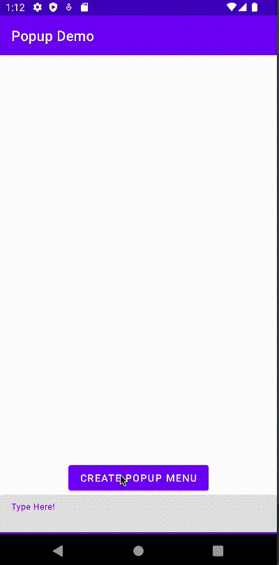

# Popup Placement Demo

## Overview
This repository demonstrates a bug in the behaviour of the PopupMenu in Android when used
in tandem with the soft keyboard (aka IME). When the keyboard is visible the popup incorrectly
renders at the location where the anchor view was on the screen prior to the keyboard being
opened. I believe this is due to the root view returning a negative y location which breaks
the algorithm that places the popup view on the screen.

## Demo Video
